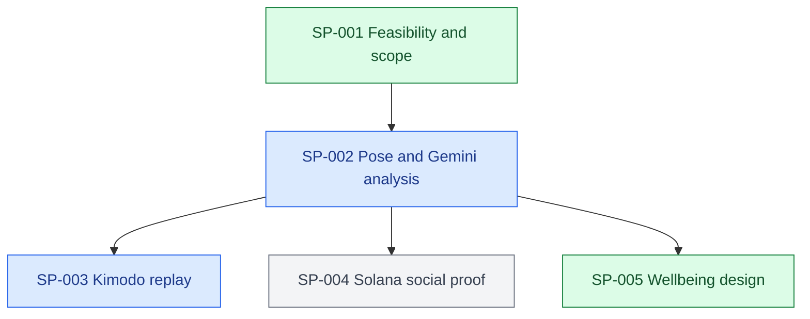

# Project Ledger

## Resume Here

| Field                      | Last observed state                                                                                                                                    |
| -------------------------- | ------------------------------------------------------------------------------------------------------------------------------------------------------ |
| Project goal               | Build a hackathon prototype that evaluates gym exercise form from video, produces a canonical 3D replay, and records social workout rewards on Solana. |
| Current phase              | Repetition fix, wellbeing redesign, and Kimodo-ready motion replay implemented; GitHub sync in progress.                                               |
| Branch / commit            | `codex/movement-review`; product commits `a1e2ec3` and `7624389`, based on remote `main` at `f3c8cc3`.                                                 |
| Active primary sub-problem | SP-002 — Pose and Gemini analysis                                                                                                                      |
| Last validated milestone   | Supplied 14.4s clip detects all five reps; 13 TypeScript and 2 worker tests, 5 Chrome workflows, lint, and production build pass.                      |
| Current blocker or risk    | Live Gemini is unconfigured; live Kimodo generation needs a supported NVIDIA host. Counter validation covers one real clip.                            |
| Exact next action          | Push the ledger checkpoint, then configure and verify Gemini/Kimodo services or begin the Solana devnet proof slice.                                   |
| Most relevant prior chat   | [Step 1 implementation](codex://threads/01a096d1-daa3-7c62-8353-be67a427c1a8)                                                                          |
| Ledger updated             | 2026-09-12T15:24:12-05:00                                                                                                                              |

## Status Legend

| Status        | Meaning                                  | Color  |
| ------------- | ---------------------------------------- | ------ |
| ✅ COMPLETE   | Acceptance criteria verified             | Green  |
| 🔵 ACTIVE     | Work currently in progress               | Blue   |
| 🟡 READY NEXT | Prerequisites satisfied                  | Yellow |
| 🟠 BLOCKED    | Cannot proceed until a condition changes | Orange |
| ⚪ DEFERRED   | Intentionally postponed                  | Gray   |
| ❌ SUPERSEDED | Replaced or abandoned                    | Red    |

## Project Goal and Scope

The proposed project, provisionally named FormChain, analyzes a short single-person gym video, identifies the exercise and repetitions, scores observable biomechanics, explains corrections, generates a canonical 3D motion replay, and writes a workout proof/reward interaction to Solana devnet. The HackWesTX VII brief supplied by the user is the authoritative event source. Medical diagnosis, injury clearance, physique/attractiveness scoring, production anti-cheat, and faithful single-camera 3D reconstruction are out of scope for the hackathon MVP.

## Working Architecture

### System Architecture

Current: Next.js 16.3.5 / React 19 app in `src/app/page.tsx`; browser video sampling in `src/lib/video.ts`; pure measurement/rep logic in `src/lib/analysis.ts`; validated Gemini route in `src/app/api/coach/route.ts` and schemas in `src/lib/coaching.ts`. Real video upload, 15 samples per second, CPU MediaPipe inference, landmark inspection, rep phase keyframes, movement graph, JSON export, and explicit synthetic sample are implemented. Gemini requires server configuration and has not been called live. Nothing is persisted or published on-chain.

Target architecture (step 4 is adapter-complete but not live-model-verified; step 5 remains unimplemented):

1. Browser captures or uploads a short clip.
2. A local pose landmarker processes frames at useful exercise cadence and computes joint angles, rep phases, visibility, and candidate keyframes.
3. Gemini receives sampled frames plus pose metrics and returns structured exercise classification, coaching cues, and a form score with confidence.
4. A GPU-side Kimodo adapter turns the exercise description and selected pose constraints into a canonical motion file for 3D playback; a prerecorded fallback protects the demo.
5. The app hashes the workout result and asks the athlete's wallet to sign a Solana devnet workout-proof transaction. MVP points are app-level; an SPL reward mint is a follow-up.

### Development Sequence

### Active Work Map

| Sub-problem | Status      | Branch / worktree                         | HEAD      | Sessions     | Blocker / next action                                       |
| ----------- | ----------- | ----------------------------------------- | --------- | ------------ | ----------------------------------------------------------- |
| SP-001      | ✅ COMPLETE | `codex/movement-review` / repository root | `7624389` | Current task | Scope approved and implemented through the motion adapter   |
| SP-002      | 🔵 ACTIVE   | `codex/movement-review` / repository root | `7624389` | Current task | Five-rep clip verified; live Gemini validation remains      |
| SP-003      | 🔵 ACTIVE   | `codex/movement-review` / repository root | `7624389` | Current task | Viewer and worker adapter verified; needs NVIDIA model host |
| SP-004      | ⚪ DEFERRED | Not started                               | —         | —            | Needs a trusted result/attestation schema                   |

## Sub-problem Index

| ID     | Title                            | Sequence | Status      | Upstream | Downstream             | Next action                            |
| ------ | -------------------------------- | -------: | ----------- | -------- | ---------------------- | -------------------------------------- |
| SP-001 | MVP architecture and feasibility |        1 | ✅ COMPLETE | None     | SP-002, SP-003, SP-004 | Scope accepted                         |
| SP-002 | Pose and Gemini analysis         |        2 | 🔵 ACTIVE   | SP-001   | SP-003, SP-004         | Validate real squat footage and Gemini |
| SP-003 | Kimodo canonical replay          |        3 | 🔵 ACTIVE   | SP-002   | Demo UI                | Verify generation on an NVIDIA host    |
| SP-004 | Solana workout proof and rewards |        3 | ⚪ DEFERRED | SP-002   | Social feed            | Implement devnet signed proof first    |

## Sub-problems

### SP-001 — MVP architecture and feasibility

#### Goal and boundaries

Determine what can be demonstrated credibly within the hackathon and separate reliable scoring from generative replay and social rewards.

#### Dependencies and downstream impact

Defines the interfaces and fallback strategy for all implementation work.

#### Current state and acceptance criteria

- State: ✅ COMPLETE
- Evidence: Official Gemini, NVIDIA Kimodo, and Solana documentation inspected on 2026-09-12.
- Acceptance criteria: User approves a bounded MVP and its stated limitations. Met by "Ok. Proceed step by step."

#### Accumulated accomplishments

- Confirmed Gemini can analyze video and return timestamped/structured output, but default static processing is too sparse for exercise mechanics by itself.
- Confirmed Kimodo supports text and kinematic constraints and exports NPZ/BVH motion, but is a generator rather than raw-video mocap.
- Identified Solana devnet signed workout proof as the reliable first on-chain slice; SPL token economics and anti-cheat are follow-ups.
- A minimal Next.js scaffold was created before the user asked to pause at feasibility review. It remains uncommitted and contains no feature implementation.

#### Branches and worktrees

| Branch | Worktree                                  | Base commit | Last observed HEAD | State                |
| ------ | ----------------------------------------- | ----------- | ------------------ | -------------------- |
| `main` | `/Users/safwankamal/Documents/HackwestTX` | Unborn      | Unborn             | Uncommitted scaffold |

#### Chat sessions

| Session                          | Link | Started / updated       | Git state                  | Scope                               | Outcome                                 |
| -------------------------------- | ---- | ----------------------- | -------------------------- | ----------------------------------- | --------------------------------------- |
| Unavailable from current surface |      | 2026-09-12 / 2026-09-12 | Unborn `main`, uncommitted | Feasibility and initial orientation | Review completed; implementation paused |

#### Decisions

- Score observable movement quality and confidence, not whether a body looks "toned."
- Use deterministic pose geometry for joint mechanics; use Gemini for recognition, phase semantics, explanations, and structured coaching.
- Treat Kimodo output as a canonical/corrected replay, not proof that the model reconstructed the athlete exactly.
- Keep off-chain score calculation separate from the on-chain proof so private video never needs to be published.

#### Blockers and open questions

- Team size and available NVIDIA GPU hardware are unknown.
- The first supported exercise has not been chosen; squat is the recommended demo path.
- Actual SPL token minting versus non-transferable app points remains a product decision.

#### Future directions

- Add deadlift, bench press, overhead press, and lunge only after the squat pipeline is reliable.
- Add server-attested scores and anti-replay controls after the devnet proof demo.

### SP-002 — Pose and Gemini analysis

- Goal: A usable squat-only clip-to-review path with observable measurements and uncertainty.
- Dependencies: SP-001 accepted. Downstream: Kimodo needs pose/phase data; Solana needs a trustworthy result schema.
- State: 🔵 ACTIVE. Implemented and software-tested; real footage and live Gemini are unverified.
- Acceptance: manually labeled footage agrees with rep counts/phase timestamps; configured Gemini produces grounded structured cues. These acceptance checks remain outstanding.
- Files: `src/lib/analysis.ts`, `src/lib/video.ts`, `src/lib/coaching.ts`, `src/app/page.tsx`, `src/app/globals.css`, `src/app/layout.tsx`, `src/app/api/coach/route.ts`, `.env.example`, package/lock files, tests, Playwright config, README, ledger.
- Validation: 8 unit tests pass (geometry, cycles, partial reps, static/empty scenes, occlusion, gaps, pixel aspect ratio, schemas); 3 browser tests pass using installed Chrome (sample/timeline/export/mobile, API bounds, real inference on blank WebM); lint and production build pass. Desktop and mobile screenshots inspected. Initial lint link error corrected; initial browser executable absence resolved by installed-Chrome channel. Download of a separate Chromium was interrupted.
- Scoring decision: Explicit range-and-tempo rubric, not a calibrated form score. No frontal knee tracking or medical claims. Exercise is provisionally selected as squat; non-squat/uncertain Gemini response hides the UI score. Client measurements are not reward attestations.
- Data: Analysis is local and ephemeral. Gemini transmission only follows its button click; maximum six keyframes. JSON export includes image-space landmarks, not Kimodo-compatible 3D constraints.
- Limits: Browser main-thread inference yields between frames but may stutter; network needed for model assets. Only side-view input with one detected person is supported. Clip length is not gym attendance duration.
- Git: `main`, unborn HEAD/base, no commit range; all work uncommitted in `/Users/safwankamal/Documents/HackwestTX`.
- Session: [01a096d1-daa3-7c62-8353-be67a427c1a8](codex://threads/01a096d1-daa3-7c62-8353-be67a427c1a8), confirmed by the app open-panel response. Work observed 2026-09-12T13:37:10-05:00 through 2026-09-12T13:53:34-05:00. Primary SP-002; related SP-001. No real gym recording or API credentials were supplied.
- Local preview: development server running at http://127.0.0.1:3000; app browser open queued. GET /api/coach confirmed configured=false. Final lint/build passed after formatting; branch still main with no commits.
- Next action: Validate real clip, tune thresholds using labeled evidence, and smoke-test live Gemini; then proceed to Kimodo mapping and service.

### SP-005 — Wellbeing interface research and redesign

- State: ✅ COMPLETE for the requested implementation; user usability research remains future work.
- Evidence: researched NHS typography/content, Oura information architecture, Apple charts/CareKit, Google PAIR, and W3C contrast/target guidance; full cited report in `docs/health-product-design-research.md`.
- Implemented: warm light palette, readable hierarchy, video-led review, fixed-height portrait viewer, selected rep tabs/intervals, phase contact sheet, tracking coverage explanation, and removal of the prominent unvalidated score.
- SP-002 update: analyzed supplied 14.373152-second front-squat video. It has 100% landmark coverage. Original detector counted one rep; same measurements now yield five at 1.40, 4.20, 6.87, 9.67, and 12.67 seconds. Fixed depth/phase-duration gates caused the undercount. Counting now uses upright-relative excursion; depth and tempo are review metrics. Extracts keyframes for every detected rep.
- Regression: reduced angle trace in `tests/fixtures/front-squat-trace.json`; raw video and exported full landmarks stay outside Git. Browser test accepts SQUAT_CLIP path so no personal path is required in source.
- Validation: 10 unit tests, 4 browser workflows including the supplied video, lint/build pass; desktop/mobile screenshots inspected. Additional accessibility scan in progress before sync.
- Branch: `codex/movement-review`, preserving remote initial README history; origin `https://github.com/Mack-Kabir/HackWestx_26.git`. User explicitly requested repository synchronization.
- Session: [Current task](codex://threads/01a096d1-daa3-7c62-8353-be67a427c1a8), 2026-09-12. Related SP-002 and SP-003. Kimodo live-host question pending; Mac is arm64 and no nvidia-smi is installed.
- Next: finish GitHub checkpoint, then Kimodo service/viewer. No production fitness-accuracy claim.

### SP-003 — Kimodo canonical replay

- State: 🔵 ACTIVE. The integration boundary and fallback viewer are implemented; live model generation remains blocked on a compatible NVIDIA host and checkpoint access.
- Implemented: dynamically loaded Three.js BVH viewer with orbit, play/pause, and scrubbing; strict 2 MB BVH grammar/numeric/frame bounds; local BVH import; authenticated server-only proxy; bounded single-worker Python queue that invokes `kimodo_gen` with SOMA-RP v1.1 and standard T-pose BVH output.
- Privacy and claims: the worker receives only squat variation and duration, never video or landmarks. The interface calls output a generated demonstration and explicitly says it neither reconstructs the athlete nor certifies technique.
- Validation: 3 motion contract/BVH tests and 2 Python worker-command tests pass; browser coverage imports and plays a fixture BVH, verifies unconfigured generation is disabled, and checks invalid/unconfigured API responses. Full result: 13 TypeScript tests, 2 worker tests, 5 Chrome workflows including the supplied video, lint, and production build pass. Full-page desktop screenshot inspected.
- Environment: local host is Apple Silicon without `nvidia-smi`; no claim of live Kimodo execution. Setup, network exposure warning, environment variables, and limitations are in `README.md` and `.env.example`.
- Git: implementation commit `7624389203da697cf3e8e960b1e94271fcd88d52` on `codex/movement-review`; draft PR #1 tracks the branch.
- Next: deploy the worker on a supported NVIDIA machine, verify `/health`, execute one front-squat generation, and inspect the returned skeleton/scale. Do not wire the output into scoring.

## Prioritized Future Chats

| Task     | Target | Priority | Readiness | Why / dependencies                                                                                | Scope and non-goals                                               | Outcome / verification                                               | Branch                       | Start chat   |
| -------- | ------ | -------- | --------- | ------------------------------------------------------------------------------------------------- | ----------------------------------------------------------------- | -------------------------------------------------------------------- | ---------------------------- | ------------ |
| NEXT-001 | SP-002 | P0       | BLOCKED   | Implementation exists; requires real squat clip and Gemini configuration for remaining acceptance | Validate count/phase accuracy and live coaching; no new exercises | Manually labeled clip matches phases; actual Gemini review succeeds  | `codex/squat-analysis-mvp`   | Unavailable  |
| NEXT-002 | SP-003 | P1       | BLOCKED   | Viewer and adapter are ready; requires a supported NVIDIA host and checkpoint access              | Verify one live generation; no faithful athlete reconstruction    | Worker health succeeds and returned BVH plays in the existing viewer | `codex/movement-review`      | Current task |
| NEXT-003 | SP-004 | P1       | BLOCKED   | Qualifies the Solana track; depends on score schema                                               | Wallet connect and devnet proof; no production token economy      | Explorer-confirmed transaction contains session hash and score claim | `codex/solana-workout-proof` | Unavailable  |

NEXT-001 handoff prompt

Use `$maintain-project-ledger`. Read `.codex/PROJECT_LEDGER.md`, starting with `Resume Here`. Work on `SP-002` / `NEXT-001`. Verify current Git state and preserve the existing implementation. Validate a real side-view squat clip against manually counted reps and phase timestamps, then verify Gemini with server-side credentials. Respect the provisional scoring and privacy decisions, run relevant tests, and update the ledger at handoff.

## Cross-cutting Decisions

| ID      | Decision                                                                                             | Rationale / evidence                                                                | Applies to | Status |
| ------- | ---------------------------------------------------------------------------------------------------- | ----------------------------------------------------------------------------------- | ---------- | ------ |
| DEC-001 | Local pose geometry plus Gemini semantics                                                            | Fast exercise motion needs denser temporal measurements than default video sampling | SP-002     | Active |
| DEC-002 | Kimodo is a canonical replay service with fallback                                                   | It generates constrained motion and requires a separate execution environment       | SP-003     | Active |
| DEC-003 | Store hashes/claims, not raw workout video, on Solana                                                | Protects privacy and keeps transactions small                                       | SP-004     | Active |
| DEC-004 | Count only visible complete cycles; withhold score below 75% tracking coverage                       | Missing frames must not fabricate repetitions                                       | SP-002     | Active |
| DEC-005 | Prototype range-and-tempo score; Gemini supplies observations rather than numerical safety judgments | Neither clinical accuracy nor general exercise recognition has been validated       | SP-002     | Active |

## State Conflicts

| ID   | Conflicting claims | Branches / commits | Required verification | Status |
| ---- | ------------------ | ------------------ | --------------------- | ------ |
| None | —                  | —                  | —                     | —      |

## Ledger History

| Timestamp                 | Branch / commit                     | Material update                                                                                                                                                 |
| ------------------------- | ----------------------------------- | --------------------------------------------------------------------------------------------------------------------------------------------------------------- |
| 2026-09-12T13:21:17-05:00 | `main` / unborn                     | Initialized ledger with feasibility findings, target architecture, risks, and proposed MVP sequence.                                                            |
| 2026-09-12T13:50:50-05:00 | `main` / unborn                     | User approved staged work. Implemented step 1 and recorded software validation, current limitations, and real-footage/Gemini acceptance checks.                 |
| 2026-09-12T14:44:46-05:00 | `codex/movement-review` / `f3c8cc3` | Reproduced and fixed five-rep undercount, implemented evidence-informed redesign, and connected requested GitHub remote without replacing existing history.     |
| 2026-09-12T15:24:12-05:00 | `codex/movement-review` / `7624389` | Added bounded Kimodo worker adapter and Three.js BVH viewer; verified 13 TS tests, 2 worker tests, 5 Chrome flows including the five-rep clip, lint, and build. |
