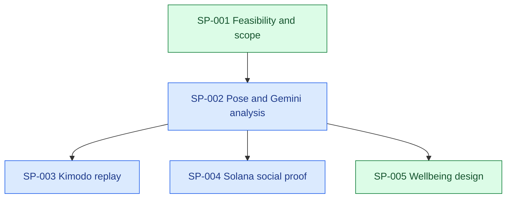

# Project Ledger

## Resume Here

| Field                      | Last observed state                                                                                                                                    |
| -------------------------- | ------------------------------------------------------------------------------------------------------------------------------------------------------ |
| Project goal               | Build a hackathon prototype that evaluates gym exercise form from video, produces a canonical 3D replay, and records social workout rewards on Solana. |
| Current phase              | Solana paused by user; Gemini frame coverage and Kimodo tempo-matched handoff hardened and locally verified.                                           |
| Branch / commit            | `codex/movement-review` at implementation commit `8366a79`; local branch is one commit ahead of origin before this ledger handoff.                     |
| Active primary sub-problem | SP-002 — Pose and Gemini analysis; related SP-003                                                                                                      |
| Last validated milestone   | 25 TypeScript tests, 3 worker tests, 5 Chrome flows including five-rep Gemini request coverage, lint, and production build pass.                       |
| Current blocker or risk    | No Gemini credentials are configured; Apple Silicon host has no NVIDIA GPU or `kimodo_gen`, so neither live provider path can execute locally.        |
| Exact next action          | Configure Gemini credentials and run one live five-rep coaching request; deploy the existing Kimodo worker to a supported NVIDIA host afterward.       |
| Most relevant prior chat   | [Step 1 implementation](codex://threads/01a096d1-daa3-7c62-8353-be67a427c1a8)                                                                          |
| Ledger updated             | 2026-09-12T16:09:20-05:00                                                                                                                              |

## Status Legend

| Status        | Meaning                                  | Color  |
| ------------- | ---------------------------------------- | ------ |
| ✅ COMPLETE   | Acceptance criteria verified             | Green  |
| 🔵 ACTIVE     | Work currently in progress               | Blue   |
| 🟡 READY NEXT | Prerequisites satisfied                  | Yellow |
| 🟠 BLOCKED    | Cannot proceed until a condition changes | Orange |
| ⚪ DEFERRED   | Intentionally postponed                  | Gray   |
| ❌ SUPERSEDED | Replaced or abandoned                    | Red    |

## Project Goal and Scope

The proposed project, provisionally named FormChain, analyzes a short single-person gym video, identifies the exercise and repetitions, scores observable biomechanics, explains corrections, generates a canonical 3D motion replay, and writes a workout proof/reward interaction to Solana devnet. The HackWesTX VII brief supplied by the user is the authoritative event source. Medical diagnosis, injury clearance, physique/attractiveness scoring, production anti-cheat, and faithful single-camera 3D reconstruction are out of scope for the hackathon MVP.

## Working Architecture

### System Architecture

Current: Next.js 16.3.5 / React 19 app in `src/app/page.tsx`; browser video sampling in `src/lib/video.ts`; pure measurement/rep logic in `src/lib/analysis.ts`; rep-aware Gemini request construction in `src/lib/coaching.ts` and `src/app/api/coach/route.ts`; Kimodo adapter/viewer with tempo-matched requests; a Solana Kit/Wallet Standard client; and server-only reward routes. Real video analysis, all-rep keyframe coverage for sets up to six reps, JSON export, local BVH playback, conditional devnet proof, HMAC attestation, wallet verification, and in-process replay rejection are implemented. Gemini and Kimodo still require external configuration. No live Gemini review, Kimodo generation, workout receipt, or production reward has been issued.

Target architecture (step 4 is adapter-complete but not live-model-verified; step 5 is self-claim-complete but not live-wallet-verified):

1. Browser captures or uploads a short clip.
2. A local pose landmarker processes frames at useful exercise cadence and computes joint angles, rep phases, visibility, and candidate keyframes.
3. Gemini receives sampled frames plus pose metrics and returns structured exercise classification, coaching cues, and a form score with confidence.
4. A GPU-side Kimodo adapter turns the exercise description and selected pose constraints into a canonical motion file for 3D playback; a prerecorded fallback protects the demo.
5. The app hashes the workout result and asks the athlete's wallet to sign a Solana devnet workout-proof transaction.
6. A separate trusted analysis issuer may create a short-lived wallet-bound reward attestation. Wallet message signing redeems it once into an off-chain points ledger; current storage is ephemeral and production issuance remains unconnected.

### Development Sequence

### Active Work Map

| Sub-problem | Status      | Branch / worktree                         | HEAD                    | Sessions     | Blocker / next action                                         |
| ----------- | ----------- | ----------------------------------------- | ----------------------- | ------------ | ------------------------------------------------------------- |
| SP-001      | ✅ COMPLETE | `codex/movement-review` / repository root | `7624389`               | Current task | Scope approved and implemented through the motion adapter     |
| SP-002      | 🔵 ACTIVE   | `codex/movement-review` / repository root | `8366a79`               | Current task | Five-rep coaching payload verified; needs live Gemini credentials |
| SP-003      | 🔵 ACTIVE   | `codex/movement-review` / repository root | `8366a79`               | Current task | Tempo-matched deterministic adapter verified; needs NVIDIA host |
| SP-004      | 🔵 ACTIVE   | `codex/movement-review` / repository root | `1994395`               | Current task | Reward core verified; needs funded wallet, trusted issuer, and durable store |

## Sub-problem Index

| ID     | Title                            | Sequence | Status      | Upstream | Downstream             | Next action                            |
| ------ | -------------------------------- | -------: | ----------- | -------- | ---------------------- | -------------------------------------- |
| SP-001 | MVP architecture and feasibility |        1 | ✅ COMPLETE | None     | SP-002, SP-003, SP-004 | Scope accepted                         |
| SP-002 | Pose and Gemini analysis         |        2 | 🔵 ACTIVE   | SP-001   | SP-003, SP-004         | Validate real squat footage and Gemini |
| SP-003 | Kimodo canonical replay          |        3 | 🔵 ACTIVE   | SP-002   | Demo UI                | Verify generation on an NVIDIA host    |
| SP-004 | Solana workout proof and rewards |        3 | 🔵 ACTIVE   | SP-002   | Social feed            | Verify live proof; connect trusted issuer and durable storage |

## Sub-problems

### SP-001 — MVP architecture and feasibility

#### Goal and boundaries

Determine what can be demonstrated credibly within the hackathon and separate reliable scoring from generative replay and social rewards.

#### Dependencies and downstream impact

Defines the interfaces and fallback strategy for all implementation work.

#### Current state and acceptance criteria

- State: ✅ COMPLETE
- Evidence: Official Gemini, NVIDIA Kimodo, and Solana documentation inspected on 2026-09-12.
- Acceptance criteria: User approves a bounded MVP and its stated limitations. Met by "Ok. Proceed step by step."

#### Accumulated accomplishments

- Confirmed Gemini can analyze video and return timestamped/structured output, but default static processing is too sparse for exercise mechanics by itself.
- Confirmed Kimodo supports text and kinematic constraints and exports NPZ/BVH motion, but is a generator rather than raw-video mocap.
- Identified Solana devnet signed workout proof as the reliable first on-chain slice; SPL token economics and anti-cheat are follow-ups.
- A minimal Next.js scaffold was created before the user asked to pause at feasibility review. It remains uncommitted and contains no feature implementation.

#### Branches and worktrees

| Branch | Worktree                                  | Base commit | Last observed HEAD | State                |
| ------ | ----------------------------------------- | ----------- | ------------------ | -------------------- |
| `main` | `/Users/safwankamal/Documents/HackwestTX` | Unborn      | Unborn             | Uncommitted scaffold |

#### Chat sessions

| Session                          | Link | Started / updated       | Git state                  | Scope                               | Outcome                                 |
| -------------------------------- | ---- | ----------------------- | -------------------------- | ----------------------------------- | --------------------------------------- |
| Unavailable from current surface |      | 2026-09-12 / 2026-09-12 | Unborn `main`, uncommitted | Feasibility and initial orientation | Review completed; implementation paused |

#### Decisions

- Score observable movement quality and confidence, not whether a body looks "toned."
- Use deterministic pose geometry for joint mechanics; use Gemini for recognition, phase semantics, explanations, and structured coaching.
- Treat Kimodo output as a canonical/corrected replay, not proof that the model reconstructed the athlete exactly.
- Keep off-chain score calculation separate from the on-chain proof so private video never needs to be published.

#### Blockers and open questions

- Team size and available NVIDIA GPU hardware are unknown.
- The first supported exercise has not been chosen; squat is the recommended demo path.
- Actual SPL token minting versus non-transferable app points remains a product decision.

#### Future directions

- Add deadlift, bench press, overhead press, and lunge only after the squat pipeline is reliable.
- Add server-attested scores and anti-replay controls after the devnet proof demo.

### SP-002 — Pose and Gemini analysis

- Goal: A usable squat-only clip-to-review path with observable measurements and uncertainty.
- Dependencies: SP-001 accepted. Downstream: Kimodo needs pose/phase data; Solana needs a trustworthy result schema.
- State: 🔵 ACTIVE. Implemented and software-tested; the supplied real footage yields five reps and all five rep bottoms reach the Gemini request, but live Gemini remains unverified.
- Acceptance: manually labeled footage agrees with rep counts/phase timestamps; configured Gemini produces grounded structured cues. Five-rep count and request coverage are met; human phase labeling and live provider checks remain outstanding.
- Files: `src/lib/analysis.ts`, `src/lib/video.ts`, `src/lib/coaching.ts`, `src/app/page.tsx`, `src/app/globals.css`, `src/app/layout.tsx`, `src/app/api/coach/route.ts`, `.env.example`, package/lock files, tests, Playwright config, README, ledger.
- Validation: rep-aware selection guarantees one bottom image for every rep when a set has at most six detected repetitions, then adds available set context. The supplied five-rep clip passes a mocked-provider browser assertion that the request contains all five labeled bottom frames. The prompt now supplies compact per-rep metrics and treats labels as untrusted timing metadata. Current full validation: 25 TypeScript tests, 3 worker tests, 5 Chrome flows, lint, and build pass.
- Scoring decision: Explicit range-and-tempo rubric, not a calibrated form score. No frontal knee tracking or medical claims. Exercise is provisionally selected as squat; non-squat/uncertain Gemini response hides the UI score. Client measurements are not reward attestations.
- Data: Analysis is local and ephemeral. Gemini transmission only follows its button click; maximum six keyframes. JSON export includes image-space landmarks, not Kimodo-compatible 3D constraints.
- Limits: Browser main-thread inference yields between frames but may stutter; network needed for model assets. Only side-view input with one detected person is supported. Clip length is not gym attendance duration.
- Git: current implementation on `codex/movement-review` at `8366a79`; draft PR #1 tracks the branch.
- Session: [01a096d1-daa3-7c62-8353-be67a427c1a8](codex://threads/01a096d1-daa3-7c62-8353-be67a427c1a8), confirmed by the app open-panel response. Work observed 2026-09-12T13:37:10-05:00 through 2026-09-12T13:53:34-05:00. Primary SP-002; related SP-001. No real gym recording or API credentials were supplied.
- Local preview: development server running at http://127.0.0.1:3000; app browser open queued. GET /api/coach confirmed configured=false. Final lint/build passed after formatting; branch still main with no commits.
- Next action: add server-side Gemini credentials and run the supplied five-rep payload against the live structured-output model; manually review whether cues are grounded in visible evidence.

### SP-005 — Wellbeing interface research and redesign

- State: ✅ COMPLETE for the requested implementation; user usability research remains future work.
- Evidence: researched NHS typography/content, Oura information architecture, Apple charts/CareKit, Google PAIR, and W3C contrast/target guidance; full cited report in `docs/health-product-design-research.md`.
- Implemented: warm light palette, readable hierarchy, video-led review, fixed-height portrait viewer, selected rep tabs/intervals, phase contact sheet, tracking coverage explanation, and removal of the prominent unvalidated score.
- SP-002 update: analyzed supplied 14.373152-second front-squat video. It has 100% landmark coverage. Original detector counted one rep; same measurements now yield five at 1.40, 4.20, 6.87, 9.67, and 12.67 seconds. Fixed depth/phase-duration gates caused the undercount. Counting now uses upright-relative excursion; depth and tempo are review metrics. Extracts keyframes for every detected rep.
- Regression: reduced angle trace in `tests/fixtures/front-squat-trace.json`; raw video and exported full landmarks stay outside Git. Browser test accepts SQUAT_CLIP path so no personal path is required in source.
- Validation: 10 unit tests, 4 browser workflows including the supplied video, lint/build pass; desktop/mobile screenshots inspected. Additional accessibility scan in progress before sync.
- Branch: `codex/movement-review`, preserving remote initial README history; origin `https://github.com/Mack-Kabir/HackWestx_26.git`. User explicitly requested repository synchronization.
- Session: [Current task](codex://threads/01a096d1-daa3-7c62-8353-be67a427c1a8), 2026-09-12. Related SP-002 and SP-003. Kimodo live-host question pending; Mac is arm64 and no nvidia-smi is installed.
- Next: finish GitHub checkpoint, then Kimodo service/viewer. No production fitness-accuracy claim.

### SP-003 — Kimodo canonical replay

- State: 🔵 ACTIVE. The integration boundary and fallback viewer are implemented; live model generation remains blocked on a compatible NVIDIA host and checkpoint access.
- Implemented: dynamically loaded Three.js BVH viewer with orbit, play/pause, and scrubbing; strict 2 MB BVH grammar/numeric/frame bounds; local BVH import; authenticated server-only proxy; bounded single-worker Python queue that invokes `kimodo_gen` with SOMA-RP v1.1, fixed seed 42, and standard-T-pose SOMA77 BVH output. Generated duration now follows the median detected rep time plus bounded start/end context, or four seconds without analysis. Worker output lookup accepts both supported single-sample BVH filename patterns.
- Privacy and claims: the worker receives only squat variation and duration, never video or landmarks. The interface calls output a generated demonstration and explicitly says it neither reconstructs the athlete nor certifies technique.
- Validation: motion duration bounds and median mapping are unit tested; 3 Python worker tests cover CLI/model/seed flags, bounds, and both output names. Full result: 25 TypeScript tests, 3 worker tests, 5 Chrome workflows including the supplied video, lint, and production build pass.
- Environment: local host is Apple Silicon without `nvidia-smi`; no claim of live Kimodo execution. Setup, network exposure warning, environment variables, and limitations are in `README.md` and `.env.example`.
- Git: implementation commit `7624389203da697cf3e8e960b1e94271fcd88d52` on `codex/movement-review`; draft PR #1 tracks the branch.
- Decision: do not derive Kimodo full-body constraints from normalized MediaPipe coordinates. Official Kimodo constraints require metric Y-up 3D positions or skeleton-local rotations; this app measures neither. The animation remains a canonical, tempo-matched demonstration and does not feed scoring.
- Git: hardening commit `8366a79` on `codex/movement-review`; local before this ledger handoff.
- Next: deploy the worker on a supported NVIDIA machine, verify `/health`, execute one front-squat generation, and inspect the returned SOMA77 BVH skeleton/scale. Do not wire the output into scoring.

### SP-004 — Solana workout proof and rewards

- State: 🔵 ACTIVE. Wallet discovery, bounded claim hashing, Memo transaction, server attestation, wallet-bound redemption, and prototype replay rejection are implemented and locally verified; a funded browser-wallet receipt and production trust dependencies remain outstanding.
- Boundaries: fixed to `solana:devnet`; only real video analyses with at least one repetition, 75% tracking coverage, and a non-null provisional metric may create a proof. Synthetic samples and incomplete/low-coverage results are excluded.
- Data: public memo contains a SHA-256 claim digest plus exercise, rep count, and set/clip milliseconds. The hashed versioned claim also commits to detector version, coverage, and range/tempo score. No frames, landmarks, coaching, or raw score are public.
- Trust: the wallet memo remains a self-claim. Rewards require a separate short-lived HMAC attestation from an authorized analysis service plus a signature from the bound wallet. The prototype rejects reused attestation, claim, evidence, and gym-visit identifiers while its process is alive. Set duration is not total gym time. No token or production points are issued.
- Policy: v1 awards accepted-set participation and capped repetition points. Only an issuer-accepted rotating-QR visit may add capped gym-time points. The provisional movement score is ignored; maximum award is 60 points.
- Implementation: `src/lib/workout-proof.ts`, `src/lib/solana-client.ts`, `src/components/workout-proof.tsx`, `src/lib/reward-policy.ts`, `src/lib/reward-server.ts`, `/api/rewards/attest`, `/api/rewards/redeem`, conditional proof UI, public RPC configuration, local validator test, opt-in live devnet smoke script, and opt-in HTTP reward verification script.
- Validation: 23 TypeScript tests pass, including exact Memo execution, attestation expiry/digest binding, wrong-wallet rejection, and replay rejection; 2 Python worker tests, lint, and production build pass. A built-server black-box test returned HTTP 201 for issuance/redemption and HTTP 409 for replay. The earlier 5 Chrome flows, supplied five-rep clip, and UI inspection remain valid because this milestone did not change UI.
- Live attempt: an explicitly labeled integration-test memo used a throwaway in-memory signer, but the public devnet faucet returned JSON-RPC internal error during funding. No transaction was submitted and no Explorer receipt exists.
- Limits: reward balances and replay keys are intentionally in-process only and reset on restart; the issuer route is disabled without independent server-only secrets. No authenticated analysis service, durable unique constraint, QR issuer, or rate limiter is connected, so reward controls remain outside the UI.
- Git: workout proof checkpoint `75a3838` is pushed. Reward implementation commit `1994395` is local before this ledger handoff.
- Next: connect an installed devnet wallet with faucet SOL and confirm one Explorer receipt. Then replace ephemeral state with a durable unique-constrained store and connect the issuer route only to a trusted analysis/QR service.

## Prioritized Future Chats

| Task     | Target | Priority | Readiness | Why / dependencies                                                                                | Scope and non-goals                                                 | Outcome / verification                                               | Branch                       | Start chat   |
| -------- | ------ | -------- | --------- | ------------------------------------------------------------------------------------------------- | ------------------------------------------------------------------- | -------------------------------------------------------------------- | ---------------------------- | ------------ |
| NEXT-001 | SP-002 | P0       | BLOCKED   | Five-rep clip/request coverage is verified; requires Gemini credentials for remaining live acceptance | Validate live structured coaching and manually inspect grounding; no new exercises | Actual Gemini review succeeds without unsupported safety/form claims | `codex/movement-review` | Current task |
| NEXT-002 | SP-003 | P1       | BLOCKED   | Viewer and adapter are ready; requires a supported NVIDIA host and checkpoint access              | Verify one live generation; no faithful athlete reconstruction      | Worker health succeeds and returned BVH plays in the existing viewer | `codex/movement-review`      | Current task |
| NEXT-003 | SP-004 | P1       | BLOCKED   | Local transaction is verified; needs an installed funded devnet wallet                            | Confirm existing wallet flow; no production token economy           | Explorer-confirmed receipt contains the expected FormChain memo      | `codex/movement-review`      | Current task |
| NEXT-004 | SP-004 | P1       | BLOCKED   | Attestation and policy core are verified; production use requires a trusted analysis issuer, durable unique-constrained store, and auditable QR service | Connect trust/storage dependencies; no SPL mint or new UI | Restart-safe replay tests and authenticated issuer integration pass | `codex/solana-reward-policy` | Unavailable  |

NEXT-001 handoff prompt

Use `$maintain-project-ledger`. Read `.codex/PROJECT_LEDGER.md`, starting with `Resume Here`. Work on `SP-002` / `NEXT-001`. Verify current Git state and preserve the rep-aware keyframe implementation. Configure Gemini server-side, submit the supplied five-rep squat payload, and manually inspect whether the structured response is grounded in the labeled images and per-rep metrics. Do not add exercises, numerical AI scoring, or unsupported safety claims. Keep credentials server-only, run relevant tests, and update the ledger at handoff.

NEXT-004 handoff prompt

Use `$maintain-project-ledger`. Read `.codex/PROJECT_LEDGER.md`, starting with `Resume Here`. Work on `SP-004` / `NEXT-004`. Preserve the existing visual design and the implemented v1 reward contract. Replace the prototype in-process ledger with a durable unique-constrained store, connect attestation issuance only to an authenticated trusted analysis service, and integrate an auditable rotating-QR visit source. Treat the wallet memo as a self-claim, do not infer gym time from clip duration, do not mint SPL tokens, run restart-safe replay tests, and update the ledger with evidence-backed validation.

## Cross-cutting Decisions

| ID      | Decision                                                                                             | Rationale / evidence                                                                | Applies to | Status |
| ------- | ---------------------------------------------------------------------------------------------------- | ----------------------------------------------------------------------------------- | ---------- | ------ |
| DEC-001 | Local pose geometry plus Gemini semantics                                                            | Fast exercise motion needs denser temporal measurements than default video sampling | SP-002     | Active |
| DEC-002 | Kimodo is a canonical replay service with fallback                                                   | It generates constrained motion and requires a separate execution environment       | SP-003     | Active |
| DEC-003 | Store hashes/claims, not raw workout video, on Solana                                                | Protects privacy and keeps transactions small                                       | SP-004     | Active |
| DEC-004 | Count only visible complete cycles; withhold score below 75% tracking coverage                       | Missing frames must not fabricate repetitions                                       | SP-002     | Active |
| DEC-005 | Prototype range-and-tempo score; Gemini supplies observations rather than numerical safety judgments | Neither clinical accuracy nor general exercise recognition has been validated       | SP-002     | Active |
| DEC-006 | Treat wallet memos as self-claims and withhold rewards until server attestation exists               | Client-generated claims can be replayed or fabricated outside the application       | SP-004     | Active |
| DEC-007 | Reward accepted participation/repetitions and verified QR time, never the provisional movement score | Current range/tempo rubric is not calibrated form quality; clip duration is not attendance | SP-004 | Active |
| DEC-008 | Keep Kimodo output canonical and tempo-matched; do not fabricate 3D constraints from 2D normalized landmarks | Kimodo expects metric Y-up positions or skeleton-local rotations that the current camera pipeline does not measure | SP-003 | Active |

## State Conflicts

| ID   | Conflicting claims | Branches / commits | Required verification | Status |
| ---- | ------------------ | ------------------ | --------------------- | ------ |
| None | —                  | —                  | —                     | —      |

## Ledger History

| Timestamp                 | Branch / commit                                   | Material update                                                                                                                                                                              |
| ------------------------- | ------------------------------------------------- | -------------------------------------------------------------------------------------------------------------------------------------------------------------------------------------------- |
| 2026-09-12T13:21:17-05:00 | `main` / unborn                                   | Initialized ledger with feasibility findings, target architecture, risks, and proposed MVP sequence.                                                                                         |
| 2026-09-12T13:50:50-05:00 | `main` / unborn                                   | User approved staged work. Implemented step 1 and recorded software validation, current limitations, and real-footage/Gemini acceptance checks.                                              |
| 2026-09-12T14:44:46-05:00 | `codex/movement-review` / `f3c8cc3`               | Reproduced and fixed five-rep undercount, implemented evidence-informed redesign, and connected requested GitHub remote without replacing existing history.                                  |
| 2026-09-12T15:24:12-05:00 | `codex/movement-review` / `7624389`               | Added bounded Kimodo worker adapter and Three.js BVH viewer; verified 13 TS tests, 2 worker tests, 5 Chrome flows including the five-rep clip, lint, and build.                              |
| 2026-09-12T15:37:51-05:00 | `codex/movement-review` / `0fda3ba` + uncommitted | Implemented bounded Solana devnet self-claim flow; verified LiteSVM transaction, 18 TS tests, 2 worker tests, 5 Chrome flows, lint, and build. Live faucet funding failed before submission. |
| 2026-09-12T15:55:54-05:00 | `codex/movement-review` / `1994395`               | Pushed the Solana proof checkpoint, then added a versioned server attestation, wallet-bound single-use redemption, capped score-independent points policy, QR-only gym-time input, and black-box API verification. |
| 2026-09-12T16:09:20-05:00 | `codex/movement-review` / `8366a79`               | Paused Solana per user request; made Gemini sampling rep-aware for the five-rep clip and hardened Kimodo with tempo matching, deterministic generation, current SOMA77 BVH handling, and explicit 2D-to-3D constraint limits. |

## Status reconciliation — 2026-09-12T15:35:39-05:00

- Read-only product status inspection verified branch `codex/movement-review`, HEAD `0fda3ba`, and one worktree at `/Users/safwankamal/Documents/HackwestTX`. Local tracking reference shows no ahead/behind marker; remote was not fetched.
- SP-004 is now implementation-in-progress, superseding the earlier deferred/not-started snapshot: uncommitted wallet UI, Solana client, bounded claim/hash/memo helpers, unit/local-validator tests, and a devnet verification script are present. Package/config, page/styles, and browser tests also have uncommitted changes. No tests or live transaction were executed in this status review; completion remains unverified.
- Prior test results above remain historical evidence. Live Gemini and Kimodo validation are still not evidenced by this review. Next priority is validating the current Solana slice, then live integrations and broader clip coverage.
- Current task ID/link: unavailable from current surface. No application code changed during this review; ledger only.
